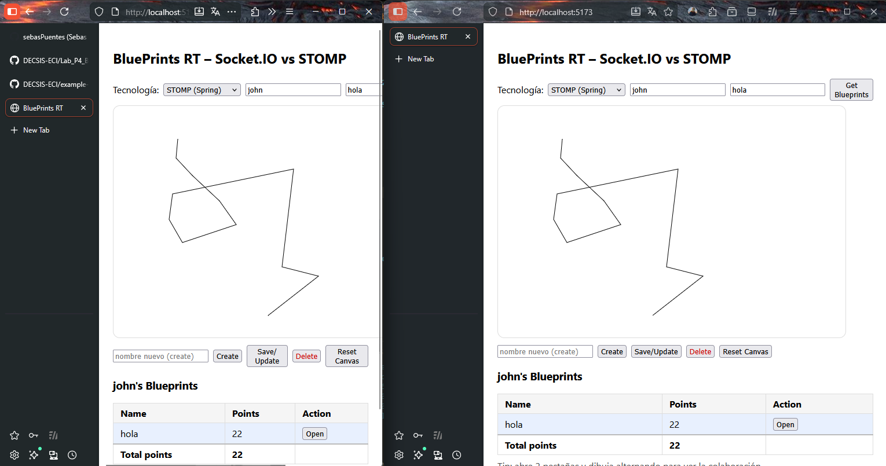

# ARSW LAB 04 - BluePrints Frontend (React + Vite)

Frontend en React para la gestion de blueprints en tiempo real mediante **Socket.IO** o **STOMP**.

## Descripcion

Aplicacion SPA que permite:

- **CRUD de blueprints** via REST contra la API Spring Boot
- **Dibujo en canvas** por clics
- **Colaboracion en tiempo real** entre multiples pestanas/clientes usando Socket.IO o STOMP
- **Tabla de blueprints por autor** con total de puntos

## Requisitos Previos

- **Node.js v18+**
- **npm**
- API REST corriendo en `http://localhost:8080` (ver [ARSW-LAB04-API](https://github.com/sebasPuentes/ARSW-LAB04-API))
- (Opcional) Backend Socket.IO en `http://localhost:3001` (ver [ARSW-LAB04-BLUEPRINT-SOCKETIO](https://github.com/sebasPuentes/ARSW-LAB04-BLUEPRINT-SOCKETIO))
- (Opcional) Backend STOMP integrado en la API (ver [ARSW-LAB04-API-STOMP](https://github.com/sebasPuentes/ARSW-LAB04-BLUEPRINT-STOMP))

## Instalacion y Ejecucion

1. **Instalar dependencias**

   ```bash
   npm install
   ```

3. **Ejecutar**

   ```bash
   npm run dev
   ```

   La aplicacion estara disponible en `http://localhost:5173`.

## Uso

1. Seleccionar la **tecnologia de Tiempo Real** en el selector
2. Ingresar un **autor** y hacer clic en "Get Blueprints" para ver sus planos
3. Seleccionar un plano de la tabla para abrirlo en el canvas
4. Hacer **clic en el canvas** para dibujar puntos
5. Abrir **dos pestanas** con el mismo plano para ver la colaboracion en vivo
6. Usar **Create/Save/Delete/Reset** para gestionar los blueprints


## Tecnologias

- **React 18** + **Vite 5**
- **@stomp/stompjs** - Cliente STOMP para WebSocket
- **socket.io-client** - Cliente Socket.IO

---

## Evidencias

**SocketIO:**


**STOMP:**



---

**Autor:** Juan Sebastian Puentes Julio

**ARSW - Arquitecturas de Software - Escuela Colombiana de Ingenieria Julio Garavito**
